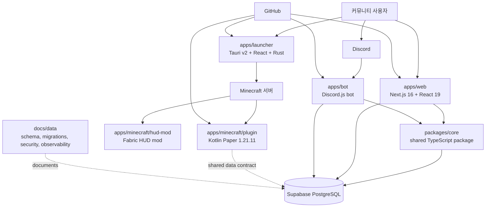

# 시스템 아키텍처

이 문서는 방울냥(Tinklepaw / Nyaru) 모노레포를 리뷰하거나 함께 변경하는 사람이 현재 구조를 빠르게 이해하도록 돕는 공개 아키텍처 문서입니다. 세부 스키마와 마이그레이션 이력은 `docs/data/` 문서를 함께 확인합니다.

## Purpose

방울냥은 한국 마인크래프트 커뮤니티를 위한 통합 플랫폼입니다. 웹 대시보드, Discord 봇, 데스크톱 런처, Minecraft 플러그인과 모드를 하나의 저장소에서 관리하고, 공유 TypeScript 패키지와 Supabase 데이터 계층을 통해 기능 간 계약을 맞춥니다.

이 문서의 목적은 다음 범위를 명확히 하는 것입니다.

- 각 앱과 패키지가 책임지는 경계
- 런타임과 배포 표면
- Supabase 중심의 공유 데이터 계약
- 로컬 개발과 리뷰 시 확인해야 할 협업 규칙

## System Context

루트 npm workspaces는 `apps/*`, `packages/*`를 포함합니다. 제품 표면은 사용자와 운영자가 접하는 앱 런타임, 서버 안에서 동작하는 Minecraft 확장, 그리고 여러 런타임이 함께 참조하는 공유 계층으로 나뉩니다.

## Module Boundaries

| 영역 | 책임 | 경계와 의존 방향 |
| --- | --- | --- |
| `apps/web` | Next.js 16, React 19 기반 웹 대시보드와 사용자 웹 경험 | Vercel 배포 표면입니다. 공유 TypeScript 계약이 필요하면 `packages/core`를 사용하고, 웹 전용 UI와 라우팅 책임은 앱 내부에 둡니다. 웹 E2E 검증은 `npm run e2e -w @nyaru/web`로 분리합니다. |
| `apps/bot` | Discord.js 기반 커뮤니티 봇과 Discord 명령 경험 | Dockerfile은 bot과 core를 함께 빌드합니다. `.github/workflows/deploy.yml`은 GHCR 이미지를 push하는 배포 파이프라인 표면입니다. |
| `apps/launcher` | Tauri v2, React, Rust 기반 데스크톱 Minecraft 런처 | 런처 UI와 Rust 명령은 앱 안에서 관리합니다. `.github/workflows/release-launcher.yml`은 `launcher-v*` 태그로 macOS와 Windows 릴리즈를 만듭니다. |
| `apps/minecraft/plugin` | Kotlin Paper 1.21.11 기반 서버 플러그인 | 서버 안의 명령어, 이벤트, 경제/플러그인 기능을 담당합니다. 빌드 산출물은 `./gradlew shadowJar`로 생성하고, `.github/workflows/release-minecraft.yml`은 `minecraft-v*` 태그로 JAR 릴리즈를 만듭니다. |
| `apps/minecraft/hud-mod` | Fabric HUD mod | 클라이언트 HUD 모드 빌드는 `./gradlew build`로 확인합니다. 서버 플러그인과 같은 Minecraft 도메인에 속하지만 별도 런타임으로 취급합니다. |
| `packages/core` | 공유 TypeScript 패키지 | 웹과 봇이 함께 쓰는 타입, Supabase 접근 계층, 공통 계약을 둡니다. 앱별 UI, Discord 명령 처리, 데스크톱 Rust 로직은 이 패키지로 끌어올리지 않습니다. |
| `supabase` | 부트스트랩, 스키마, 마이그레이션 | 데이터 구조와 DB 변경의 원천입니다. 공개 설명 문서는 `docs/data/README.md`, `schema.md`, `erd.md`, `migrations.md`, `security.md`, `observability.md`와 ADR `docs/adr/2026-06-18-supabase-shared-data-contract.md`를 기준으로 합니다. |

## Runtime And Deployment Map

| 런타임 | 로컬 실행/빌드 | 배포 또는 릴리즈 표면 |
| --- | --- | --- |
| 웹 대시보드 `apps/web` | `npm run dev:web`, `npm run e2e -w @nyaru/web` | Vercel |
| Discord 봇 `apps/bot` | `npm run dev:bot` | Dockerfile로 bot/core 빌드, `.github/workflows/deploy.yml`에서 GHCR 이미지 push |
| 데스크톱 런처 `apps/launcher` | `cd apps/launcher && npm install && npm run tauri dev` | `.github/workflows/release-launcher.yml`, `launcher-v*` 태그, GitHub Releases macOS/Windows 산출물 |
| Minecraft Paper 플러그인 `apps/minecraft/plugin` | `cd apps/minecraft/plugin && ./gradlew shadowJar` | `.github/workflows/release-minecraft.yml`, `minecraft-v*` 태그, JAR 릴리즈 |
| Minecraft Fabric HUD mod `apps/minecraft/hud-mod` | `cd apps/minecraft/hud-mod && ./gradlew build` | 저장소 기준 빌드 산출물로 검증 |
| Supabase 데이터 계층 `supabase` | 부트스트랩 SQL과 마이그레이션 파일 적용 | Supabase 프로젝트의 PostgreSQL 스키마와 정책 |

## Shared Data Contract

공유 데이터 계약은 Supabase 스키마, 마이그레이션, 공개 데이터 문서, 그리고 TypeScript 공유 패키지가 함께 형성합니다.

- DB 구조와 마이그레이션 순서는 `supabase/`와 `docs/data/migrations.md`를 기준으로 검토합니다.
- 테이블, 관계, 보안 정책, 관측성 설명은 `docs/data/schema.md`, `docs/data/erd.md`, `docs/data/security.md`, `docs/data/observability.md`에서 확인합니다.
- Supabase를 여러 앱이 공유하는 결정 배경은 `docs/adr/2026-06-18-supabase-shared-data-contract.md`에 기록되어 있습니다.
- `packages/core`는 TypeScript 런타임이 공유하는 타입과 Supabase 접근 계약을 담는 경계입니다.
- Kotlin 플러그인, Rust 런처, Fabric 모드처럼 TypeScript가 아닌 런타임은 같은 데이터 의미를 사용하더라도 각 런타임의 빌드와 검증 흐름에서 계약 drift를 별도로 확인해야 합니다.

## Local Development Flow

1. 루트에서 Node.js 20+, npm 10+ 환경을 준비하고 `npm install`을 실행합니다.
2. 웹과 봇을 함께 볼 때는 `npm run dev`를 사용합니다.
3. 개별 런타임은 `npm run dev:web`, `npm run dev:bot`으로 나누어 실행합니다.
4. 웹 변경은 필요 시 `npm run e2e -w @nyaru/web`로 브라우저 흐름을 확인합니다.
5. 런처는 `apps/launcher`에서 `npm install` 후 `npm run tauri dev`로 확인합니다.
6. Paper 플러그인은 `apps/minecraft/plugin`에서 `./gradlew shadowJar`로 산출물을 만듭니다.
7. Fabric HUD mod는 `apps/minecraft/hud-mod`에서 `./gradlew build`로 확인합니다.
8. Supabase 변경은 `supabase/` SQL 파일과 `docs/data/` 문서를 함께 검토하고, PostgREST 스키마 캐시 갱신이 필요한지 확인합니다.

## External Services

| 서비스 | 사용 표면 | 문서화 원칙 |
| --- | --- | --- |
| Supabase | PostgreSQL 데이터베이스, 인증/데이터 접근 계약 | URL, 키, 운영 식별자는 문서에 넣지 않고 `docs/data/`의 공개 구조와 정책 설명만 유지합니다. |
| Vercel | `apps/web` 배포 표면 | 웹 런타임 경계와 빌드/배포 책임만 기록합니다. |
| Discord | `apps/bot`, 웹 인증 흐름 | 토큰 값이나 운영 설정값 없이 명령 경험과 OAuth 리다이렉트 형태만 설명합니다. |
| GitHub Actions | 봇 이미지 push, 런처 릴리즈, Minecraft JAR 릴리즈 | workflow 이름, 태그 규칙, 산출물 종류를 공개 가능한 수준으로 기록합니다. |
| GHCR | 봇 Docker 이미지 레지스트리 | 이미지 push 표면만 설명하고 배포 대상의 세부 접근 정보는 기록하지 않습니다. |
| GitHub Releases | 런처와 Minecraft 플러그인 릴리즈 | 태그 패턴과 산출물 종류를 기록합니다. |
| Microsoft OAuth | 런처 로그인 | 사용자 로그인 역할만 설명하고 앱 등록 세부값은 문서화하지 않습니다. |
| Minecraft/Paper/Fabric | 서버 플러그인과 클라이언트 HUD mod | 대상 버전과 빌드 명령을 기준으로 변경을 리뷰합니다. |

## Collaboration Rules For Architecture Changes

- 앱 경계, 배포 표면, 공유 데이터 계약이 바뀌면 이 문서를 같은 PR에서 업데이트합니다.
- README는 진입점 역할만 유지하고, 큰 구조 설명은 이 문서로 보냅니다.
- Supabase 스키마나 정책이 바뀌면 `supabase/` 변경과 함께 `docs/data/` 및 관련 ADR의 갱신 필요성을 확인합니다.
- `packages/core`의 공유 타입이나 Supabase 접근 계약이 바뀌면 웹과 봇의 영향 범위를 함께 검토합니다.
- 런처, Paper 플러그인, Fabric HUD mod는 TypeScript workspace와 다른 빌드 체인을 사용하므로 각 앱의 전용 빌드 명령을 별도로 기록하고 검증합니다.
- 공개 문서에는 운영 키, 토큰, 실제 배포 식별자, 개인 로컬 경로를 넣지 않습니다.

## Known Limitations And Tradeoffs

- 루트 `.web-dev.log`가 공개 트리에 남아 있으며, 이번 문서 작업에서는 삭제하지 않습니다. 정리는 issue #1 cleanup follow-up에서 다룹니다.
- 이 문서는 리뷰어용 상위 구조 문서입니다. API별 세부 동작, DB 컬럼 설명, RLS 세부 정책은 `docs/data/` 문서와 각 앱 문서를 기준으로 합니다.
- `packages/core`는 TypeScript 앱 간 계약을 강하게 맞추지만 Kotlin, Rust, Fabric 런타임까지 자동으로 타입을 공유하지는 않습니다. 다중 언어 경계에서는 문서와 빌드 검증을 함께 사용해야 합니다.
- 배포 표면이 Vercel, GHCR, GitHub Releases, Minecraft 서버 산출물로 나뉘어 있어 하나의 검증 명령으로 전체 릴리즈 안정성을 보장하기 어렵습니다. 변경 범위별 명령을 조합해 확인합니다.
