# Entity Relationship Diagram

Status: draft

## Main Relationship Path

This diagram focuses on the review path for identity, points, gacha, inventory,
stock/economy, and Minecraft integration. Operational tables such as logs,
notifications, voice rooms, and config are documented in `schema.md` and
`observability.md`.

```mermaid
erDiagram
    USERS {
        text discord_user_id PK
        text username
        text avatar_url
        timestamptz created_at
        timestamptz last_seen_at
    }

    POINT_BALANCES {
        text discord_user_id PK,FK
        integer balance
        integer daily_chest_streak
        integer tuna_forge_energy
        timestamptz updated_at
    }

    POINT_EVENTS {
        uuid id PK
        text discord_user_id FK
        text kind
        integer amount
        text idempotency_key
        jsonb meta
        timestamptz created_at
    }

    ITEMS {
        uuid item_id PK
        text name
        text rarity
        text discord_role_id
        boolean is_active
        jsonb metadata
    }

    GACHA_POOLS {
        uuid pool_id PK
        text name
        text kind
        boolean is_active
        integer cost_points
        integer pity_threshold
        text pity_rarity
    }

    GACHA_POOL_ITEMS {
        uuid pool_id FK
        uuid item_id FK
        integer weight
    }

    GACHA_USER_STATE {
        text discord_user_id FK
        uuid pool_id FK
        integer pity_counter
        integer total_pulls
        timestamptz updated_at
    }

    GACHA_PULLS {
        uuid pull_id PK
        text discord_user_id FK
        uuid pool_id FK
        boolean is_free
        integer spent_points
        timestamptz created_at
    }

    GACHA_PULL_RESULTS {
        uuid pull_id FK
        uuid item_id FK
        integer qty
        boolean is_pity
        boolean is_variant
    }

    INVENTORY {
        text discord_user_id FK
        uuid item_id FK
        integer qty
        timestamptz updated_at
    }

    EQUIPPED {
        text discord_user_id PK,FK
        uuid item_id FK
        timestamptz equipped_at
    }

    STOCK_MARKET {
        integer id PK
        text symbol
        text display_name
        numeric current_price
        integer fee_bps
    }

    STOCK_CANDLES {
        timestamptz bucket_start PK
        numeric open_price
        numeric high_price
        numeric low_price
        numeric close_price
        numeric volume_buy
        numeric volume_sell
    }

    STOCK_HOLDINGS {
        text discord_user_id PK,FK
        numeric qty
        numeric avg_price
    }

    STOCK_NYANG_BALANCES {
        text discord_user_id PK,FK
        integer balance
    }

    MINECRAFT_PLAYERS {
        uuid minecraft_uuid PK
        text discord_user_id FK
        text minecraft_name
        timestamptz linked_at
    }

    MINECRAFT_JOBS {
        uuid minecraft_uuid PK,FK
        text job
        integer level
        integer xp
    }

    MC_MARKET_ITEMS {
        text item_id PK
        text category
        text display_name
    }

    MC_MARKET_TRADES {
        uuid trade_id PK
        uuid minecraft_uuid FK
        text item_id FK
        integer quantity
        integer price
        timestamptz created_at
    }

    USERS ||--|| POINT_BALANCES : owns
    USERS ||--o{ POINT_EVENTS : records
    USERS ||--o{ INVENTORY : owns
    USERS ||--o| EQUIPPED : equips
    ITEMS ||--o{ INVENTORY : appears_in
    ITEMS ||--o{ GACHA_POOL_ITEMS : offered
    GACHA_POOLS ||--o{ GACHA_POOL_ITEMS : contains
    USERS ||--o{ GACHA_USER_STATE : tracks
    GACHA_POOLS ||--o{ GACHA_USER_STATE : tracks
    USERS ||--o{ GACHA_PULLS : performs
    GACHA_POOLS ||--o{ GACHA_PULLS : drawn_from
    GACHA_PULLS ||--o{ GACHA_PULL_RESULTS : yields
    ITEMS ||--o{ GACHA_PULL_RESULTS : awarded
    USERS ||--o{ STOCK_HOLDINGS : holds
    USERS ||--|| STOCK_NYANG_BALANCES : wallet
    STOCK_MARKET ||--o{ STOCK_CANDLES : snapshots
    USERS ||--o| MINECRAFT_PLAYERS : links
    MINECRAFT_PLAYERS ||--o| MINECRAFT_JOBS : progresses
    MC_MARKET_ITEMS ||--o{ MC_MARKET_TRADES : traded
    MINECRAFT_PLAYERS ||--o{ MC_MARKET_TRADES : executes
```

## Verification Notes

- The diagram is a reviewer-oriented relationship view, not a generated schema
  dump. It omits operational/config/log surfaces to keep the main domain model
  readable.
- When this diagram changes, confirm the Mermaid block renders in GitHub
  Markdown as part of review.
- If a target-repo maintainer confirms additional active relations, add them in
  a follow-up PR instead of overloading this first diagram.
